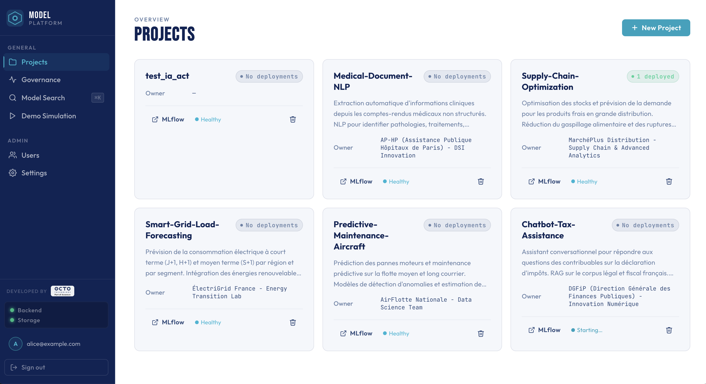
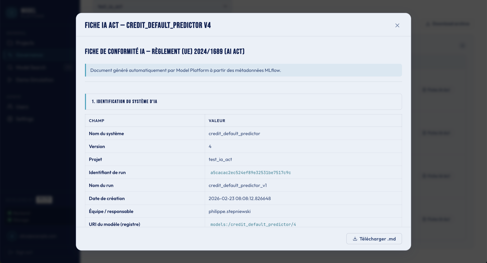
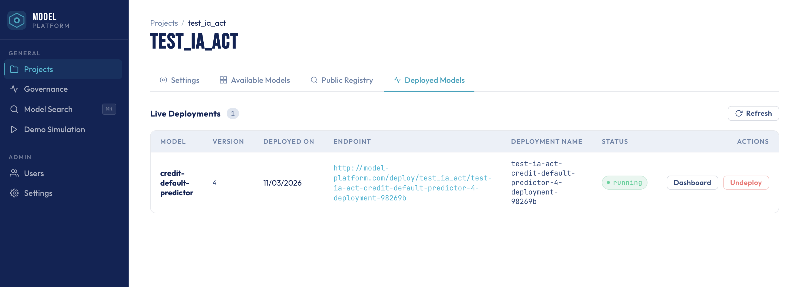
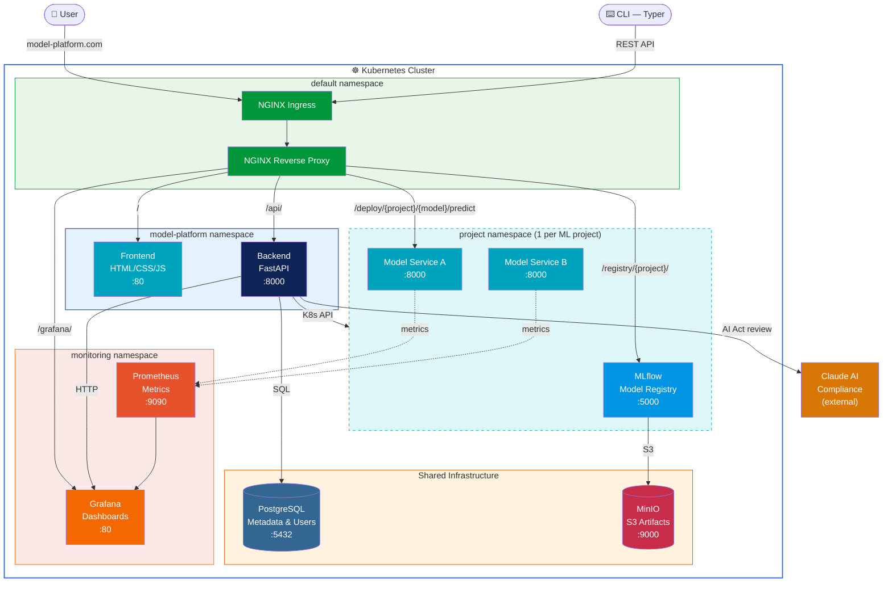
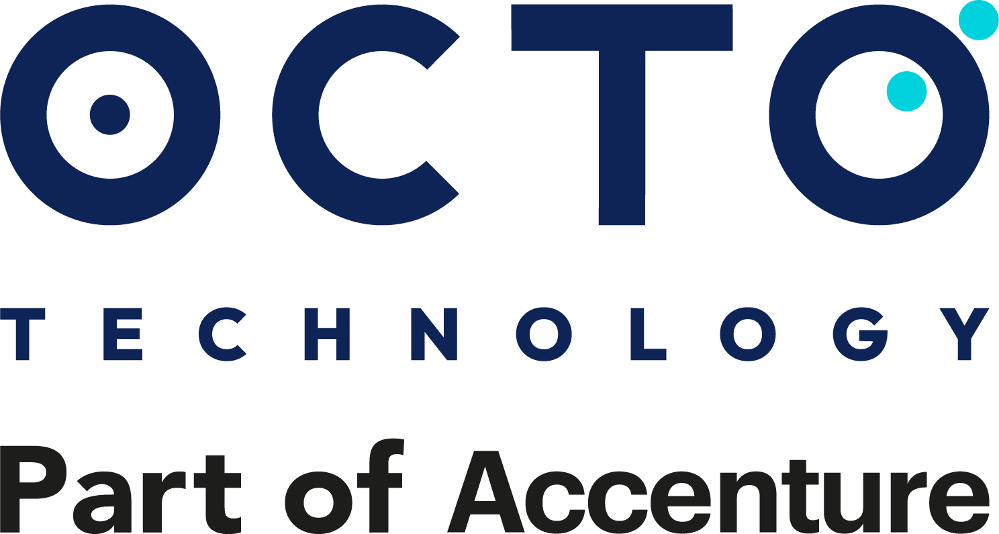

# Model Platform

**Deploy, govern, and monitor ML models on Kubernetes — with built-in EU AI Act compliance.**


---

## What is Model Platform?

Model Platform is an open-source MLOps platform that lets ML engineers **version, deploy, host, and govern** machine learning models on Kubernetes with minimal configuration. It bridges the gap between model training (MLflow) and production serving — while generating the compliance documentation that the **EU AI Act** now requires.

## Why?

Deploying ML models to production is still manual and fragmented. Most teams glue together scripts, CI pipelines, and custom tooling — with no audit trail and no governance story.

Meanwhile, the **EU AI Act** (effective 2025) requires documentation, traceability, risk classification, and human oversight for AI systems. Compliance can't be an afterthought bolted onto spreadsheets.

Model Platform solves both: **one platform for deployment and governance**.

## Key Features

- **One-click deployment** — Push any MLflow model to Kubernetes with a single action. Auto-provisioned namespace, service, and ingress.
- **EU AI Act compliance cards** — Auto-generated regulatory documentation per model: risk classification, Article 11 technical docs, traceability records.
- **AI-assisted compliance review** — Claude analyzes your model card and generates AI Act compliance assessments.
- **Per-project namespace isolation & RBAC** — Each project gets its own Kubernetes namespace with role-based access control.
- **Governance audit export** — One-click ZIP export of all compliance artifacts for regulatory review.
- **Automatic monitoring dashboards** — Grafana dashboards auto-provisioned per deployed model (latency, throughput, errors).
- **Full-text search across model metadata** — Search across all model cards, descriptions, and metadata from a single search bar.

## Screenshots

### Projects Overview

*Multi-project platform with governance scope visible at a glance — project cards show owner, deployed models, and MLflow status.*

### EU AI Act Governance

*Auto-generated EU AI Act compliance cards with risk classification, Article 11 documentation, and traceability — the unique differentiator.*

### Model Deployment

*Deploy and monitor model in one click*

## Architecture

*C4 Container diagram — shows the major containers and their interactions within the Kubernetes cluster.*



## Quick Start

See **[HOWTO.md](HOWTO.md)** for full setup instructions (Minikube, Helm, secrets, deployment).

```bash
# TL;DR
brew install minikube kubectl helm
minikube start --cpus 2 --memory 7800 --disk-size 50g
make k8s-infra
make create-backend-secret POSTGRES_PWD=... JWT_SECRET=... ADMIN_EMAIL=... ADMIN_PWD=...
make k8s-modelplatform
# → http://model-platform.com
```

## Tech Stack

| Component | Technology |
|-----------|-----------|
| Backend API | **FastAPI** (Python, Clean Architecture) |
| Frontend | **HTML/CSS/JS** (served by NGINX) |
| CLI | **Typer** (`mp` command) |
| Model Registry | **MLflow** |
| Database | **PostgreSQL** |
| Object Storage | **MinIO** (S3-compatible) |
| Orchestration | **Kubernetes** (Minikube for dev) |
| Monitoring | **Grafana / Prometheus** |
| AI Compliance | **Claude** (Anthropic) |

## Documentation

- [HOWTO.md](HOWTO.md) — Setup & deployment guide
- [CONTRIBUTING.md](CONTRIBUTING.md) — Contribution guidelines
- [docs/](docs/) — Architecture decisions, model card templates, and more

---

<p align="center">
  
  <br/>
  Built by <strong>OCTO Technology</strong>
</p>
