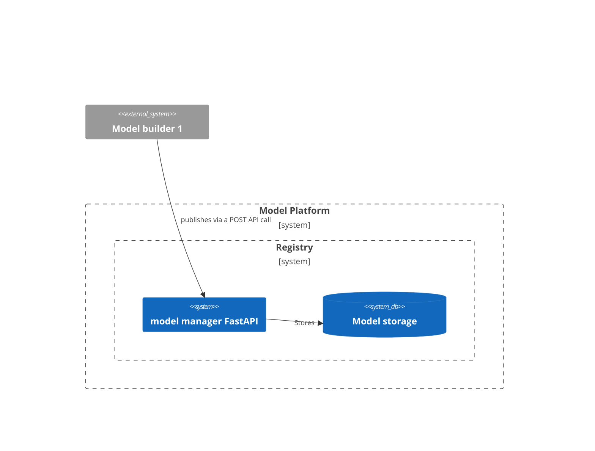

# Model platform

*Octo MLOps tribe*

## Context

What solution should we implement for our model registry, a part of our model platform. 
The goal of the model registry is to store the model artifacts, metadata, status, and inference code. 

## Options

## 1. Using MLFlow as a model registry

- #### Pros
  - Obvious one : Popular and maintained opensource model registry
    - UI
    - Lots of connectors for different storage solution
    - Has a rest API for interacting with mlflow
  - Used by MLG with some already available wrappers

- #### Cons
  - Heavy weight solution with a lot of unnecessary features? 

- #### Example of architecture for the registry and storage

## 2. Designing our own model registry

- #### Pros
    - Homemade fully APIsed without a UI. No need to install additional package on the computer creating the model
    - We could make it easier/userfriendly to use than MLFLOW is. Especially if we don't care about all the experiments part. 

- #### Cons
    - Probably reinventing a lightweight, UI free MLFlow?
    - As for now, not sure how we can send heavy model artifacts, code, and metadata inside an post query
      (seems possible from what I saw but we would have to spike it first with FastAPI)
    - We would have to add custom wrappers for the storage connectors 

- #### Example of architecture for the registry and storage

## Decision

## Actions

