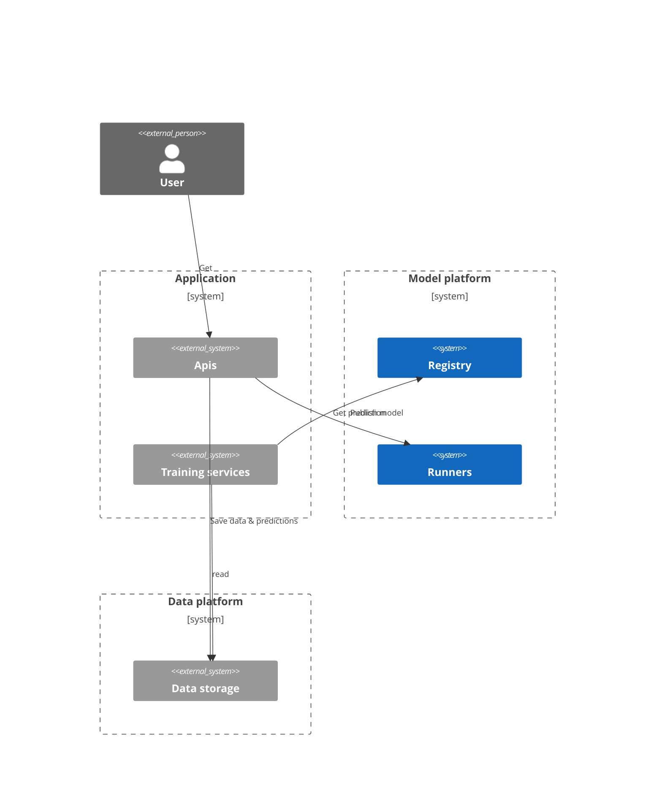
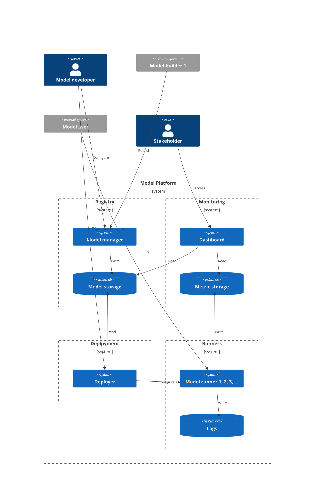

# What is it ?

A tribe project to build a Model Platform

## Intentions

1. Build a project as a team
2. Test, identify, consolidate convictions on model management at scale
3. Be as portable as possible
4. Use opensource technologies

## Vision and key features of a Model Platform

> **Vision**
     For **models developers**, so that they can **focus on building the best model**, we offer **a model platform** that can **version, deploy, host, govern** models with as few configuration as possible
     For **application developers**, so that they can **integrate models seamlessly**, we offer **a model platform** that can provide a simple API to call.

Key features:
- **Store models**. Model can be ML model, LLM prompts, Optimization, Process Model
  - Model are to be stored with :
    - Metadata (for whom, how, what, which data, ...)
      - Some metadata can be mandatory
    - Code for an endpoint.
- **Host inference endpoints**.
  - Endpoints would offer prediction on demand
- **Deploy model**
  - Model deployment can be naive (on / off) or advanced (A/B, ...)
- **Collect metrics**
  - Business metrics
  - Technical metrics
- **Offer visualisation of KPI**
- **Security**
  - Model / data segregation.
  - Access management

## Architecture

### System level

A few comments:
- In application, there is often a huge segregation between training service and APIs, it can often be on the developer laptop, in a specific environment.
- Having models runners in the model platform is debatable
  - Argument 1: Model concern the application, so it should be in application system
    - Counterargument: Model can be shared across applications (e.g. LLM model)
  - Argument 2: A data platform only offer storage, why offer compute
    - Counterargument: Not a database, and the trend (with dbt, snowflake, ...) is to go back to compute with storage
  - Running model requires specific resources that an API doesn't need
  - It is a fun idea to test
  - Models are often a brick of a product and not the product. Meaning, that the feature is included in a bundle of other features.

### Detailed architecture

A few comments:

**Registry**
- Model can be published to model manager by a training service (either a CI, a service, a dev laptop)
  - Rights to publish should be configured and then checked
- Model manager should control that mandatory metadata are given with the model
- Model manager could provide an interface, but it requires to set up authentication, a service, etc. Doesn't seem mandatory
- Inspiration: MLFlow registry

**Deployments**
- Deployments are configured as code, they can be triggered by a new model being published, a threshold passed by a metric, a human action
- Model storage should accept any format of models. Pickle, joblib, ...
- Inspiration: various CI tools

**Runners**
- Model runners publish standards technical metrics (number of calls, time to answer a call), and offer a capacity to publish custom business metrics
- Model runners don't store any form of business (and thus confidential or personal) data, it is the responsibility of calling app
- For advanced deployment scenarios, a load balancer will be needed to send users to correct endpoint
- Model developer will need to access its runners logs easily.
- A runner is a concatenation of a model and the code to run it. The code is produced by developer and should be easy to deploy (a docker image ?)
- Inspiration: Kubernetes
- Open question ? how to choose runner size ?
  - The presence of a GPU, can be set through a model metadata.
- Inferences can be a call for a single line, but could also be batchs
  - For batch such an architecture doesn't seem relevant.

**Monitoring**
- Monitoring offers observability on model lifecycle (ex: when was it last updated, how many models, which themes)
- Monitoring offers usage metrics
- Custom metrics, that are not comparable between projects are not to be stored here.

**Generic notes**
- Databricks does all of that, plus offer a model development environment.

## Implementation choices
