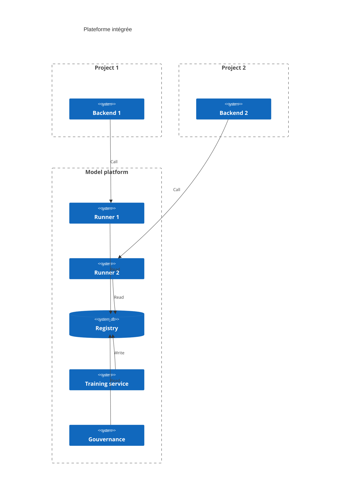

# Patterns de models platforms

## Contexte
Nous étudions les différents patterns de plateformes de modèles à l'échelle

Nous avons 4 fonctionnalités principales identifiées ;
- Train (dans le cas des modèles de ML)
- Run (capacité à faire des prédictions)
- Registre (versioning de modèles)
- Gouvernance (avoir une vue sur l'ensemble des modèles)

## Décentralisé

Avantages : 
- Scalabilité à l'infini en nombre de projet, chaque projet a ces ressources et peut-être autonome
- Possibilité d'avoir une stack technique hétérogène (plusieurs clouds provider, plusieurs solutions)

Inconvenient : 
- La gouvernance à l'échelle requiert plus d'intégration des informations de chaque service
- Les ressources de run, de registre sont déployés à chaque projet, cela ralentit le Time To Market
  - Mitigation (partielle) possible : offrir des templates

NB : 
- Une implémentation peu consister à mettre la mémoire de l'ensemble des registres sur un stockage communs (tel que le datalake) pour mettre au même endroit toutes infos et faciliter le travail de gouvernance.
- Le runner est ici intégré au backend

Adapté pour : 
- Les organisations qui ont le besoin et les moyens de développés de très nombreux produits sur différentes stack techniques

## Registre centralisé

Avantages : 
- La gouvernance à l'échelle est simplifié, tous les modèles sont au même endroit
- Train et backend, contenant tous les 2 de la logique métier restent rassemblés

Inconvénients : 
- Le registre devient un goulot d'étranglement, les utilisations du registre peuvent être hétérogènes (par exemple en nombre de projets)
- MLflow le registre le plus connu, couple expérimentation et registre, il faut donc se passer de MLflow, ou passer outre sa philosophie.

Adapté pour : 
- Les organisations qui veulent forcer un seul standard de registre, et accélérer la gouvernance

## Registre et runner centralisé

Avantages : 
- En plus de faciliter l'identification des modèles à l'échelle de l'organisation des métriques standardisées peuvent être collectées pour suivre les modèles
- Les ressources de calculs spécifiques aux modèles (type GPU) peuvent être mutualisées
- Le déploiement de modèle peut être standardisé et offrir des fonctionnalités sous forme de config (telles que l'A/B testing, la shadow production, etc)

Inconvénients : 
- Cela ajoute une latence à la prédiction (qui nécessite un appel supplémentaire entre backend et runner)
- Les données (éventuellement) confidentielles sont partagés à un service de plus
  - Mitigation (partielle) possible : ne garder les données qu'en mémoire, et laisser la responsabilité de sauvegarder au backend

NB : 
- Une ségrégation au sein de la modèle plateforme peut avoir lieu pour avoir un registre / 1..n runners par projets.

Adapté pour : 
- Les organisations qui souhaitent accélérer et standardiser le travail de déploiement et de run

  
## Plateforme intégrée

Avantage : 
- Tout ce qui touche aux modèles est centralisé

Inconvénients : 
- Backend (donc logique métier) et train (donc logique métier) sont séparés, les équipes sans doute aussi, les métiers risques d'expliquer 2 fois la même chose.

Adapté pour : 
- Les équipes produisant des modèles et assurant le run centralisée au service des équipes "produit"
